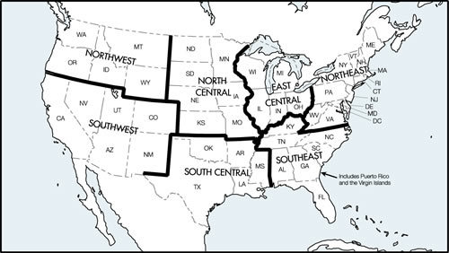
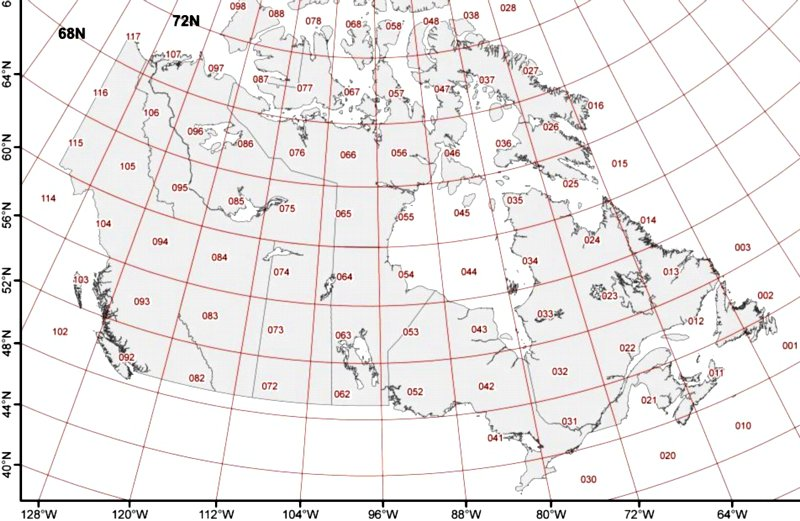

# FAA Charts Reference

For current and accurate FAA chart maps, please visit this FAA
website: [Online FAA Chart Maps](http://www.faa.gov/air_traffic/flight_info/aeronav/digital_products/ "FAA Chart Maps")

**Note:** Under the Downloads list on the FAA website, select the
chart type for which you'd like to see a map legend. For example, to
see a map showing the area covered by each of the FAA Sectional
charts, click on the "Sectional Raster Charts" link.

**The following FAA chart maps are for offline reference only, and are
not updated.**

## Sectionals and TACs

## WACs

## A/FD

## ELUS (Note: Avare area division not shown)

## EHUS (Note: Avare area division not shown)

## Canada Topo Grid

As far North as 60N covered.

We are investigating the potential for adding more capabilities for flying Avare in Canada. It would be helpful if anyone interested in this topic would post a message on our Forum, so we can gauge how many of our users fly Avare in Canada and would like to see more capabilities added. Also what specific capabilities might be most useful.

Clearly, having official Canadian charts and data would be very popular and helpful, but to date we have been unable to obtain free materials of that kind.

To fly Avare in Canada as of this writing (October 8, 2014), be sure you go to Map, Options, Preferences, Display, and turn on Show All Bases. That enables you to Find any Canadian destination that is in Avare's database and fly GPS direct even without any map displayed. To display a Canadian map, in the Download menu near the bottom is a category currently named "Topographic Maps(42)" which currently only contains Canada Grid maps numbered 1-114. To find out which grid map(s) you need for the area you fly, consult this map.

In the current version of Avare, you might encounter some difficulty in switching between U.S. charts and Canadian Topo. If so, it might help to use Simulation mode if your current position is not in Canada. If that does not help you might also Exit and restart Avare. We very much want to improve and add more Canadian capabilities in Avare, but receive very little feedback and few inquiries. If you fly Avare in Canada or would like to, please contact us on our Forum.

Click the image to open larger version in a new window
