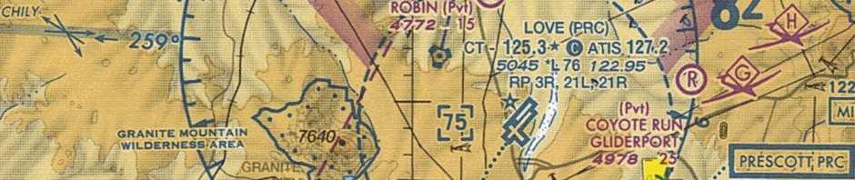

## Welcome

> We are aviators dedicated to providing aviation apps that are simple to use, making flying more safe, fun and affordable.

Our team produces
[**Avare**](https://play.google.com/store/apps/details?id=com.ds.avare&hl=en_US&gl=US),
an [Electronic Flight
Bag](https://en.wikipedia.org/wiki/Electronic_flight_bag) for
[Android](https://en.wikipedia.org/wiki/Android_(operating_system))
devices.

Avare provides GPS active location on all FAA charts, Airport Diagrams
and Approach Plates; along with CS (AF/D), weather & TFRs, Flight
Plans and much more.



-   Internet is only required for installing or updating the free app
	and free FAA resources
-   Ground planning and in-flight operations work offline, even in
	"Airplane Mode" for maximum battery life
-   GPS (internal or external to the Android device) is required for
	location services

## Resources
<!--\[caption id="attachment\_69936" align="alignnone" width="640"\] Map screen during offline ground planning on a phone (Airplane Mode, GPS off, Avare v8.1.2).\[/caption\]-->

-   To see videos about Avare, please visit our 
	[**YouTube Channel**](https://www.youtube.com/channel/UC0OSj8qmkSg01DIilEzxHGg "Avare Videos")
-   Visit the [**Google Play Store**](https://play.google.com/store/apps/details?id=com.ds.avare "Avare page on Google Play Store")
	to read reviews and install the software
-   Visit our
	[**Forum**](https://groups.google.com/d/forum/apps4av-forum "Apps4Av Forum")
	to see the latest news, feature requests, and discussion

* * *

## Introductory video

<!--Formatting ideas from https://www.ankursheel.com/blog/full-width-you-tube-video-embed-->

  <iframe 
    class="video"
    src="https://www.youtube.com/embed/rj1IDKaG3Wo" 
    allowfullscreen>
  </iframe>

<!--

* * *

[**Apps**](https://apps4av.net/site/apps/ "+Apps") - Starting in 2018 Apps4Av is releasing new Android apps useful for anyone but not specifically designed for aviators. To learn more, [**Click here.**](https://apps4av.net/site/apps/ "+Apps")

**Older Apps** (most features now included in Avare):

**
I-Timer**, a simple app for IFR pilots that's also useful for VFR pilots and even as a basic household timer.

-   To visit the **Google Play store page for I-Timer** where you can read Reviews and Install,
**[Click here.](https://play.google.com/store/apps/details?id=com.ds.itimer "I-Timer on Google Play Store")**

* * *

**
In-Flight Instruments** (**I-FI**) AI/Heading app.

-   To visit the **Google Play store page for I-FI** (In-Flight Instruments) where you can read Reviews and Install, 
**[Click here.](https://play.google.com/store/apps/details?id=com.ds.gyro "I-FI page on Google Play Store")**

* * *

**
Avare** external I/O plugin app, that provides add-on functionality to
Avare. Currently, it is mostly used for connecting Avare to external
flight simulators and experimental auto-pilots.

-   To visit the **Google Play store page for Avare** add-on where you can read Reviews and Install, 
**[Click here.](https://play.google.com/store/apps/details?id=com.apps4av.avarehelper "Avare add-on page on Google Play Store")**

* * *

**
Avare** Bluetooth GPS app to convert a second **Android** device such
as a phone into a Bluetooth GPS, so you can place it for optimum GPS
signal and provide reliable location to your primary Avare device.

-   To visit the **Google Play store page for Avare** Bluetooth GPS, where you can read Reviews and Install,
**[Click here.](https://play.google.com/store/search?q=com.apps4av.bluetoothgps&c=apps&hl=en "Avare Bluetooth GPS on Google Play Store")**

* * *

**
Chart Sack** is GPS app that lets you navigate on any chart of your
choice, offline. Use a topographic map from the Internet, scan a paper
map, or even draw one yourself. The only requirements for the charts
are that they are to scale, and are in a JPEG, BMP, GIF, or PNG file
format.

-   To visit the **Google Play store page for Chart Sack** GPS app, where you can read Reviews and Install, 
**[Click here](https://play.google.com/store/apps/details?id=com.chartsack.charts "Chart Sack on Google Play Store").**

-->

Additional videos are available on our [**YouTube Channel**](https://www.youtube.com/channel/UC0OSj8qmkSg01DIilEzxHGg "Avare Videos").

* * *

## Donate to support Avare

-   Apps4Av Inc. is a registered, <a href="http://corp.sec.state.ma.us/CorpWeb/CorpSearch/CorpSummary.aspx?FEIN=463956765">non profit organization</a> in the state of MA.
-   [Donations](/donate.html) are tax deductible

## Contact Us

We are an all-volunteer group! To save time and better serve all our
users, we want to communicate with you via our
**[Forum](https://groups.google.com/forum/#%21forum/apps4av-forum
"Apps4Av Forum")**.  Your questions and requests, or tricks and tips
are helpful for everyone using our apps. If you feel this site should
be updated, please submit an [edit](/edit.html)!
